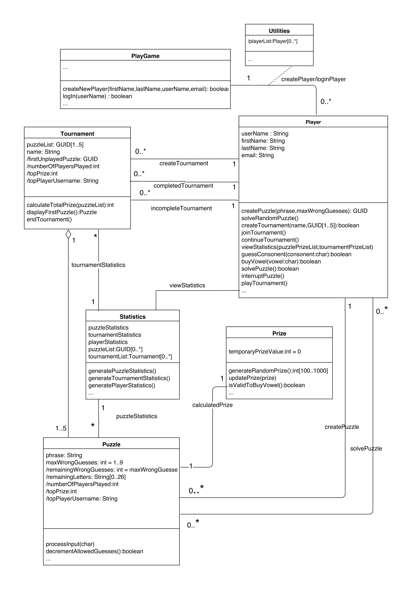
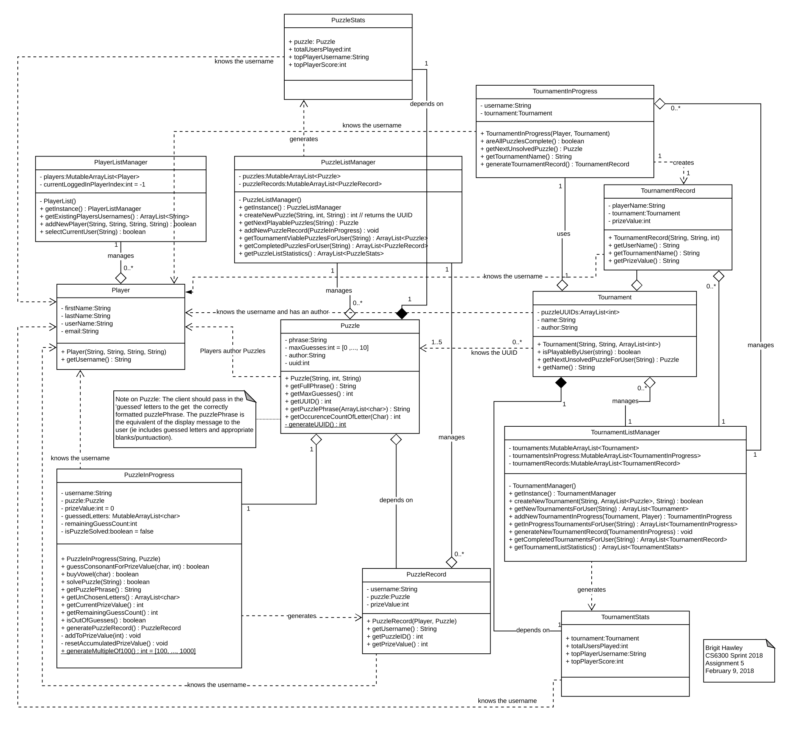
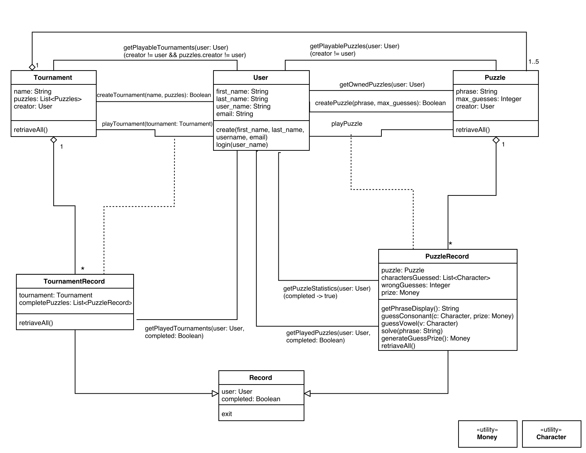
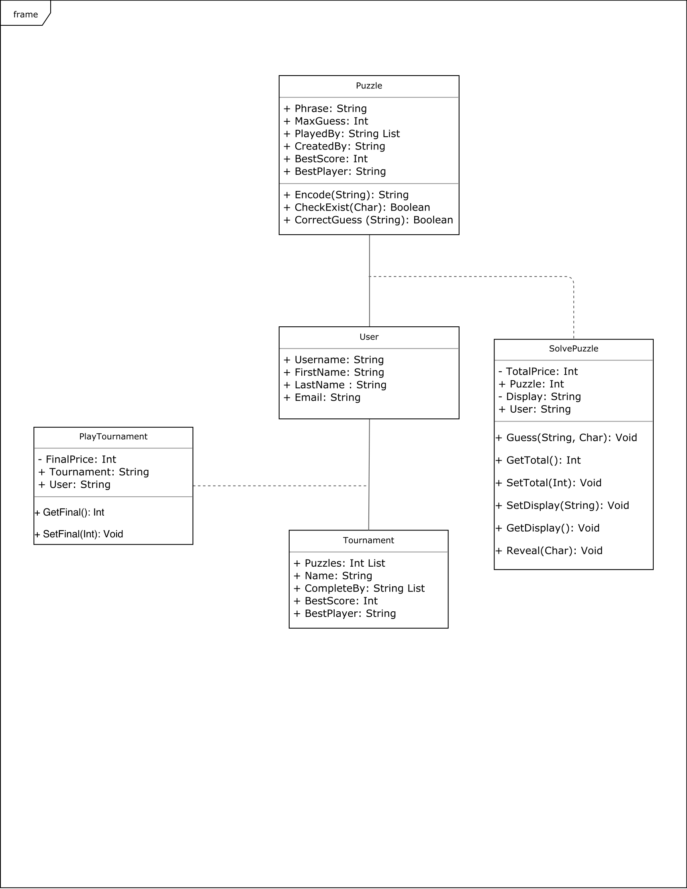

# Design Discussion
## Design 1 (rsilva32)

- This design has captured the overall design aspects and logic, simple and easy to follow. However, it’s missing some features such as it doesn’t indicate how the puzzles and tournaments in progress are handled. This design heavily depends on HashMaps and Lists local to Player to keep track of the Puzzle/Tournament records.

* Pros:
   * Having a separate Class to handle Statistics is an elegant way to manage statistics and data
   * Informative diagram  which covers all the relevant operations and attributes
   * It’s a great idea to use a separate Prize class which encapsulates prize manipulation related operations. 
   * Having an interface in Prize class for generating a random prize value and determining if the Player can buy a vowel if the current price is greater than $300 are nice operations to have.
   * Has managed to indicate all the relevant cardinalities and major relationships between classes
   * It is elegant to have a separate interface to select the Player of the User(PlayGame class) and to handle Login/create player operations

* Cons: 
   * Missing some return types and public/private declarations
   * Heavily depends on the Player class which contains most of the data structures of the entire system. Having such one massive class to manage something is hard to maintain/work with.
   * Puzzle/Tournament creation operations are in the Player class which should be Puzzle/Tournament classes
   * The utility class is nearly empty as it contains only the playetList<Player>. The design can be further improved by moving Tournament/Puzzle lists into utility class from the Player class
   * Lists are managed through Lists/HashMaps in Utilities and Player classes rather than ListManager classes
   * Doesn’t have the operation to generate GUID/UUID of Puzzles

## Design 2 (bhawley3)

- This design captures almost all the requirements of the design while being informative and accurate. However, this design is complex and it is slightly difficult to understand the need for the “InProgress” classes which could have been handled directly in the Puzzle/Tournament record classes.

* Pros:
  * Collection/ListManager classes allow for easy management of the various Player, Tournament and Puzzle classes
  * Clearly denotes with proper naming all the attributes, types, operations and relationships where relationships are denoted with accurate and effective descriptions
  * The operations and state variables are distributed properly and don’t depend on a single class heavily which in turn helps to manage and maintain the design effectively
  * Has indicated all the relevant cardinalities, public/private declarations, and the standard UML symbology is used correctly
  * It’s elegant to have separate classes to denote Puzzle/Tournament statistics(PuzzleStats and TournamentStats) and Puzzle/Tournament records to maintain history and key features effectively
    *Special notes are added to further describe design decisions

* Cons:
   * ListManagers may be redundant as they appear along the lines of a DB implementation. So may not necessary for the model
   * Singleton pattern is used in ways that are unnecessary for the requirements
   * The design is complex and can be further simplified
   * Diamond mark in lines indicating aggregation/composition relationships is on the wrong end
   * Both the PuzzleListManager and PuzzleRecord have copies of the same Puzzle while Both the TournamentListManager and TournamentRecord have copies of the same Tournament. This may lead to inconsistency as one or both copies may become out of synchronization
   
## Design 3 (rjohnson348)

- Simple, yet informative design. Classes are neatly organized and easy to follow. Captures the requirement of the applications elegantly and accurately.

* Pros:
  * Uses the standard UML symbology correctly.
  * Smart design of the inheritance of the Records class/interface. Good design of the completed attribute in the Record class. It makes it very clear to the reader how/when it is being used by noting the completed: condition.
  * It’s very informative to define the connections instead of simply adding methods to the a specific class. It might not be a UML standard to show relationships but it’s very helpful for readers to follow and understand the logics
  * Clearly denotes n to n relationships between classes.
  * The usage of the utility class is very smart. By defining utility classes, we can set certain constraints to some data types when it is being used frequently in the application.

* Cons:
  * UML doesn't differentiate between public/private members/methods.
  * It’s not clear what class some methods belongs to. For example, the playTournament method. Consider adding a manager class for user-tournament association and user-puzzle association that contains the methods managing all interactions between tournament/puzzle and user. This class will also provide the functionality to interact with the database such as adding records, query and get max.
  * Minor issues such as typos and missing parenthesis.

## Design 4 (hwang404)

- Captures the overall concept and logics required for this application. However, without enough explanation, it’s hard to follow how each requirement is met. Granted that all query is done on the database, necessary methods for a specific query application shall be specifically defined.

* Pros:
  * Classes are sensible and have member variables that are appropriate.
  * Negating to have member variables of other class types means that you can keep the classes modular.
  * Followed the professor’s course to create association classes which helps to understand.
  * Classes are neatly designed so there is no duplicate data stored in different classes that will potentially generate inconsistency issues.
* Cons:
  * UML design missing some detail and methods. For example how do tournaments work without a connection to Puzzle? This can be done through the puzzle list that the tournament object is maintaining. However, it’ll be clearer if a method is defined.
  * A lot of your design is dependent on the GUI managing the state of the system. UI should not be responsible for managing system level states because it’ll lead to low cohesion and high coupling.
  * Missing class initiation methods.
  * Make method variables public is risky.
  * Get and set methods are not necessary. It’ll be helpful for developers but not necessarily the main methods the Users will need to interact with the database.
Missing relationships between classes.

## Team Design
Team Design to come (TBD)
## Summary
The team decided to go with a design that was a mixture/compilation of Design 2 and Design 3. We decided to remove several classes and associated definitions from Design 2 incorporating aspects from Design 3 that handle these removals. Below is a list of the adjustments we made between Design 2 and 3 to come up with our final Team Design.

* Incorporate Record interface/inheritance from Design 3 into Design 2
* Remove InProgress classes from Design 2 mirroring Design 3 in which the Record has the completed state flag/marker
* Remove generateRecord methods and replace with a exit/finalize to indicate completed record
* Removed Singleton “getInstance” in favor of Dependency Injection Design 2
* ‘getTournamentViablePuzzlesForUser()’ language does not match the get tournaments for user. Should make these use the same nomenclature
* Add note to UML for buyVowel to indicate that prize value will decrement by 300
* Perhaps same thing for ‘‘getTournamentViablePuzzlesForUser’ - what does this mean? (puzzles can’t have been completed or created by the user).
