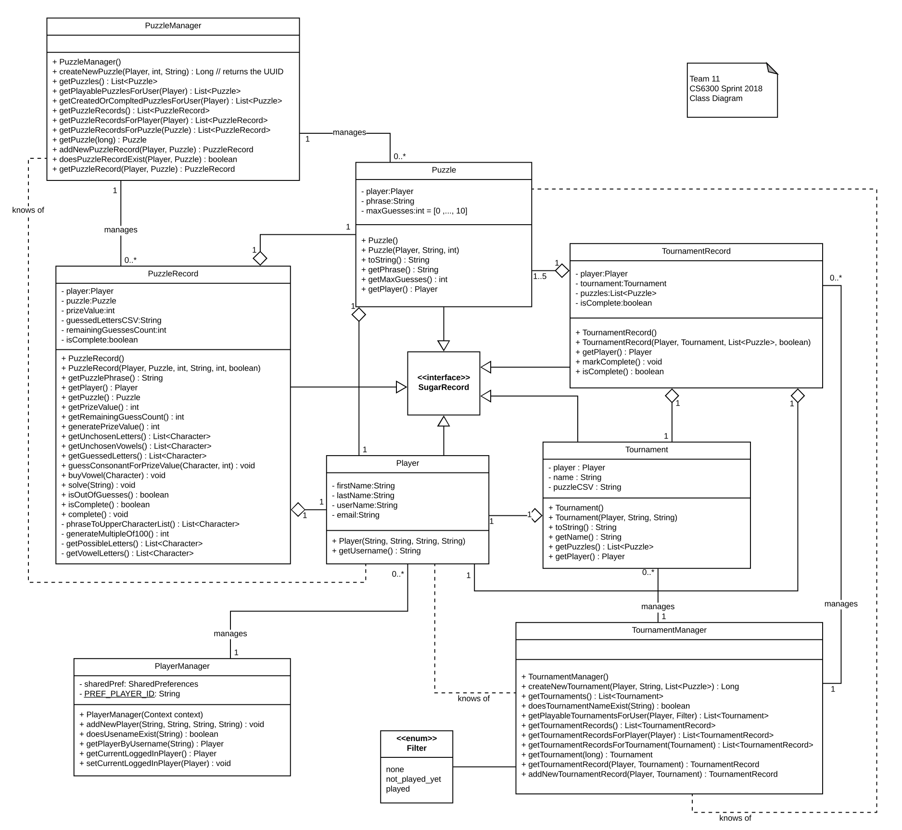

# Design Document

**Author**: Team11

## 1 Design Considerations

*The subsections below describe the issues that need to be addressed or resolved prior to or while completing the design, as well as issues that may influence the design process.*

### 1.1 Assumptions

* This application is Android only. No other platforms will be supported.
* The application is meant to be run from a single device (i.e. no cloud saving)
* Multiple users can use the same device. 

### 1.2 Constraints

* The UI must responsive. 
* The UI should be understandable.
* The application should use a reasonable percentage of system resources (memory, battery, etc.)

### 1.3 System Environment

* To run this application, the user's device will have a minimum OS requirement of Jelly Bean (4.1 onward)
* To run this application, the user's device will require a device with a minimum of 20 MB

## 2 Architectural Design

*The architecture provides the high-level design view of a system and provides a basis for more detailed design work. These subsections describe the top-level components of the system you are building and their relationships.*

### 2.1 Component Diagram

### 2.2 Deployment Diagram

*This section should describe how the different components will be deployed on actual hardware devices. Similar to the previous subsection, this diagram may be unnecessary for simple systems; in these cases, simply state so and concisely state why.*

## 3 Low-Level Design

*Describe the low-level design for each of the system components identified in the previous section. For each component, you should provide details in the following UML diagrams to show its internal structure.*

### 3.1 Class Diagram

### 3.2 Other Diagrams

None at this time. Will be included later when code sequences are better defined. 

## 4 User Interface Design

The following images are by no means final and are subject to change. These are a few screenshots of what the UI might look like

